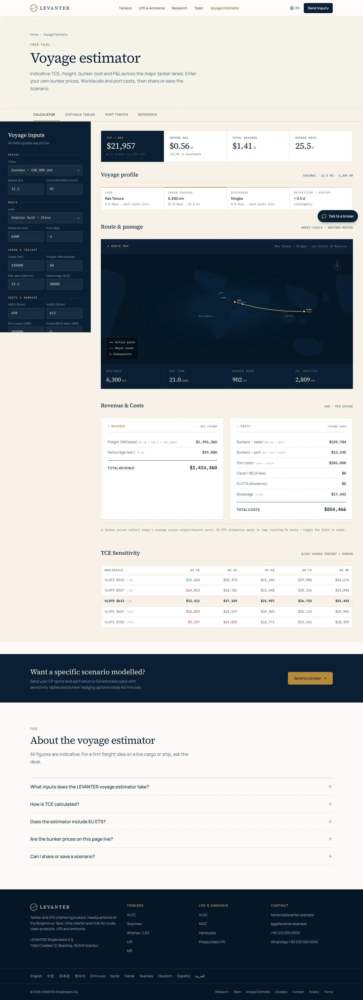
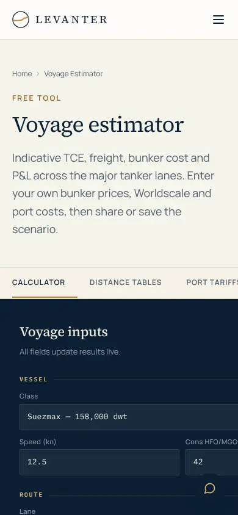

# LEVANTER: Tanker ve LPG odaklı yeniden tasarım

Bu doküman, sitenin **tanker ve LPG brokerliğinde öne çıkmak** amacıyla nasıl yeniden yapılandırıldığını özetler: rakip analizi, sadeleştirme, SEO, altyapı ve tasarım değişiklikleri, önce/sonra ekran görüntüleri.

## 1. Piyasadaki örnekler (rakip taraması)

Taranan firmalar: Poten & Partners, Braemar, Clarksons, Gibson, Fearnleys, BRS, SSY, McQuilling. Bilgiler firmaların kendi sayfalarının arama sonuçlarındaki özetlerinden alındı. Siteler bu ortamdan doğrudan açılamadığı için görsel tasarım özellikleri doğrulanamadı.

| Firma | Konumlandırma | Tanker ve LPG nasıl sunuluyor |
| --- | --- | --- |
| Poten & Partners | Enerji ve taşımacılık piyasalarında brokerlik, danışmanlık, analiz | LNG, LPG ve Oil Tanker brokerliği ayrı sayfalarda; haftalık LPG ve tanker raporları |
| Braemar | "Expert advisors in investment, chartering and risk management" | Deep Sea Tankers ile LPG & Petrochemicals ayrı sayfalarda; LPG sayfasında sayılarla kanıt |
| Clarksons | Gaz brokerliği: LPG, LNG ve amonyak | Segment başına (VLGC/LGC, PCG, NH3) isimli sorumlu; herkese açık sözlük |
| Gibson | 1893'ten beri faaliyette, %100 çalışan sahipliğinde | Tankers ile "LPG, Ammonia & Petrochemical Gases" ayrı; "Find a Broker" dizini; ücretsiz haftalık rapor |
| Fearnleys | 1869'a dayanan geçmiş | Fearntank ve Fearngas ayrı markalar; masa başına telefon hattı |
| BRS | Her fixture'da uyum kontrolü | Tanker ve Gas iş kolları; pressurised'dan VLGC'ye kadar sınıflar |

**Benimsenen ortak kalıplar**

- **Segment bazlı menü.** Tanker ve LPG/amonyak ayrı; altında VLCC…MR ve VLGC…Pressurised sınıf sayfaları.
- **LPG ile amonyak birlikte.** Amonyak ve petrokimya gazları LPG masasında.
- **Masaya göre broker dizini.** Doğrudan e-posta ve WhatsApp.
- **Hizmet döngüsünün tamamı.** Spot, TC ve COA'dan post-fixture'a (laytime, demuraj, claim) kadar.
- **Uyum (compliance) mesajı.** Her fixture öncesi yaptırım taraması.
- **Ücretsiz, indekslenebilir araştırma notları ve sözlük.**

**LEVANTER'ı farklılaştıranlar**

- **Türk Boğazları uzmanlığı.** Karadeniz tahminlerine boğaz geçiş ve bekleme süresi ekleniyor.
- **Küçük LPG gemileri.** Akdeniz, Karadeniz ve Türkiye'de pressurised ve semi-ref gemiler; büyük brokerların ikinci planda tuttuğu bir niş.
- **Hız sözü.** 60 dakikada ilk yanıt; WhatsApp.
- **Şeffaf hesap.** Ücretsiz voyage estimator ve LPG cbm ↔ mt dönüştürücü.
- **Çok dilli açılış sayfaları.** Denizcilikte öne çıkan pazarlar için.

## 2. Sadeleştirme

| Kaldırılan | Yerine |
| --- | --- |
| Dry Bulk, Sale & Purchase sayfaları | 301 yönlendirme → `/` (odak: tanker ve LPG) |
| Offices + 4 şehir sayfası | Ofisler `/contact` sayfasında; 301 yönlendirme |
| 14 ayrı, içeriği zayıf broker profil sayfası | Masalara göre gruplanmış tek `/brokers` sayfası (+ Person JSON-LD) |
| Filtre ve sıralama içeren broker dizini, sekmeli araştırma portalı | Sunucuda oluşturulan basit listeler |
| 4 adımlı teklif sihirbazı | Tek sayfalık form: e-posta veya WhatsApp'ı hazır doldurulmuş açar |
| Karanlık mod, çerez banner'ı, sahte "Client login" | Kaldırıldı (Vercel Analytics çerez kullanmıyor) |
| 4.185 satırlık global CSS | Yaklaşık 150 satır global CSS + Tailwind; hesaplayıcı stilleri yalnızca kendi sayfasında yükleniyor |

## 3. Yeni içerik

- **`/lpg`:** LPG ve amonyak masası. VLGC benchmark tablosu (BLPG1–3), hizmetler, kargolar ve **LPG cbm ↔ ton dönüştürücü**.
- **`/lpg/vlgc`, `/lpg/mgc`, `/lpg/handysize`, `/lpg/pressurised`:** Sınıf rehberleri; her birinde rotalar, izlenecek konular ve SSS.
- **Üç yeni LPG araştırma notu:** VLGC'de Panama mı Cape mi, Akdeniz ve Karadeniz'de küçük LPG, MGC'de amonyak.
- **Sözlüğe 14 LPG terimi:** VLGC, MGC, semi-refrigerated, IGC Code, filling limit vb.
- **10 dilde açılış sayfası:**

  | Kod | Dil |
  | --- | --- |
  | `/zh` | Çince |
  | `/ja` | Japonca |
  | `/ko` | Korece |
  | `/el` | Yunanca |
  | `/no` | Norveççe |
  | `/da` | Danca |
  | `/sv` | İsveççe |
  | `/de` | Almanca |
  | `/es` | İspanyolca |
  | `/ar` | Arapça, sağdan sola |

  Sitenin geri kalanı İngilizce. Dil sayfaları hreflang ile birbirine bağlı.

## 4. SEO

- Her sayfada tek H1, benzersiz title ve description, canonical. 38 URL'de denetlendi.
- **hreflang:** `en` + 10 dil + `x-default`. Hem HTML'de hem sitemap'te.
- **JSON-LD:**
  - Organization
  - ProfessionalService: İstanbul; adres, geo ve çalışma saatleri ile
  - Service + OfferCatalog: masalar ve sınıflar
  - BreadcrumbList, FAQPage, Article, ItemList (Person), DefinedTermSet, SoftwareApplication
- **Anahtar kelime hedefleri:** "LPG shipbroker", "tanker broker Istanbul", "VLGC chartering", "MGC charter", "Aframax chartering Mediterranean", "Black Sea tanker broker", "ammonia carrier chartering".
- **Sitemap:** Sahte "şimdi" tarihi yerine gerçek `lastModified`.
- **robots.txt:** Sadeleştirildi; AI arama botlarına izin veriliyor.
- **llms.txt ve llms-full.txt:** Yeni yapıyla güncellendi.

## 5. Altyapı

- **Güvenlik başlıkları:** HSTS, X-Content-Type-Options, X-Frame-Options, Referrer-Policy, Permissions-Policy. `poweredByHeader` kapalı.
- **Yönlendirmeler:** Kaldırılan tüm sayfalar için kalıcı 301/308 yönlendirme.
- **Paylaşılan JS:** Sayfa başına ilk yükleme 107 kB'den 96 kB'ye düştü. `next-themes` ve çerez bileşeni kaldırıldı.
- **Ortak düzen:** Nav ve Footer tek bir root layout'ta; sayfalar artık tekrar etmiyor.
- **Hata düzeltmeleri:**
  - Mobilde menü butonunun ekran dışına taşması
  - Hesaplayıcıdaki `view${…}` sınıf hatası
  - Hesaplayıcı giriş kutularının panelden taşması
  - Kırık `#contact` bağlantısı
- **Doğrulama:** Lint, Prettier, TypeScript, 46 Vitest testi ve production build temiz.

## 6. Ekran görüntüleri

### Önce

| Sayfa | Masaüstü | Mobil |
| --- | --- | --- |
| Ana sayfa |  |  |
| Tankers |  |  |
| İletişim |  |  |

### Sonra

| Sayfa | Masaüstü | Mobil |
| --- | --- | --- |
| Ana sayfa |  |  |
| LPG & Amonyak |  |  |
| VLGC |  |  |
| Tankers |  |  |
| İletişim |  |  |
| Voyage Estimator |  |  |
| 中文 |  |  |
| Ελληνικά |  |  |
| العربية |  |  |

## 7. Yayından önce yapılması gerekenler

1. **Alan adı:** Vercel'de `NEXT_PUBLIC_SITE_URL` ortam değişkenine gerçek alan adını girin. Şu an `levanter.example`.
2. **İletişim ve ekip bilgileri:** Telefon, WhatsApp, e-posta ve adres `lib/site.ts`'te; ekip bilgileri `lib/data/brokers.ts`'te. Şu an yer tutucu değerler var.
3. **Piyasa tablosu:** `lib/data/market.ts`'teki değerler örnek amaçlıdır ("illustrative" uyarısıyla gösteriliyor). Haftalık güncelleyin ya da kaldırın.
4. **Çeviriler:** `lib/i18n.ts`'teki çevirileri ana dili bu diller olan birer kişiye kontrol ettirin.
